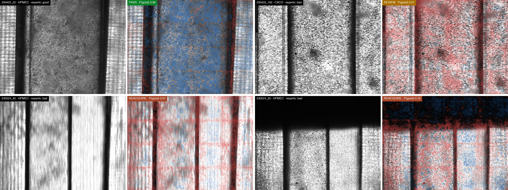
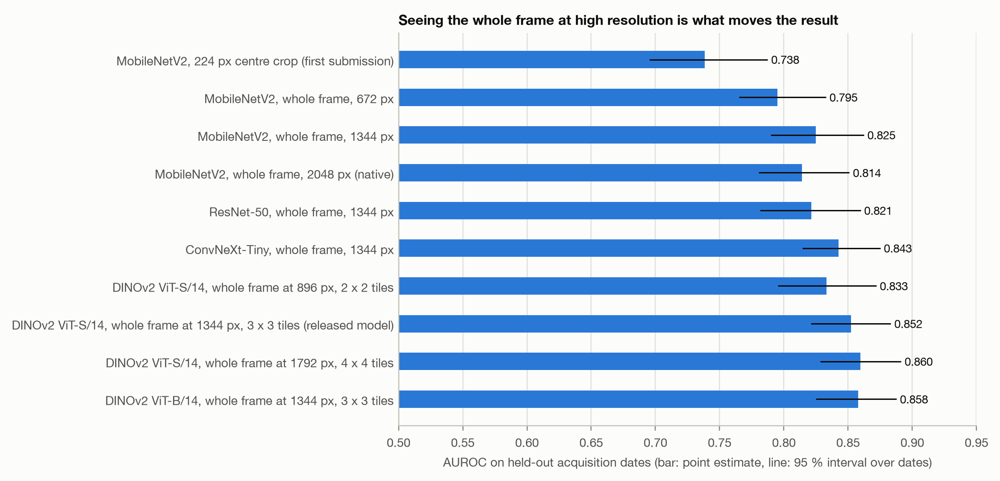
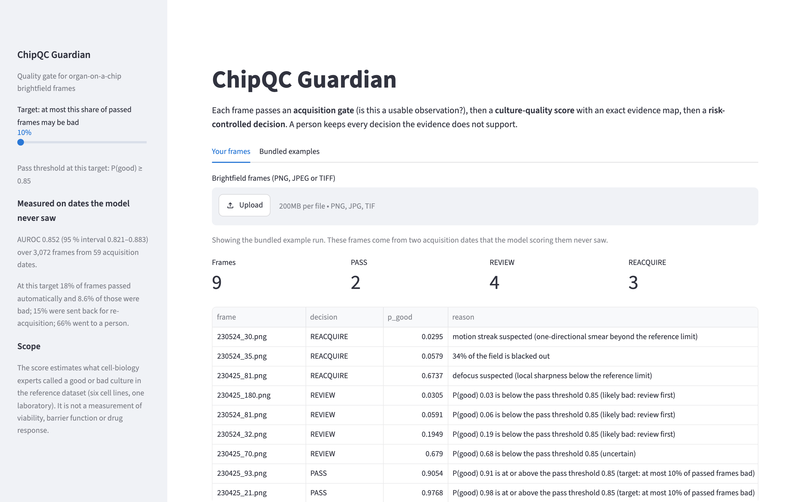

# ChipQC Guardian

**An auditable quality gate for organ-on-a-chip brightfield imaging.** Entry for [AI4S Open Innovation: AI for Life Science](https://www.kaggle.com/competitions/ai-4-s-open-innovation-artificial-intelligence-for-life-scien) (category: End-to-End System).

Before an organ-on-a-chip culture is dosed, stained or measured, someone looks at brightfield frames and decides whether the culture is usable. ChipQC Guardian turns that look into a logged, checkable step. Every frame gets one of three outcomes, with the evidence behind it:

| Outcome | Meaning | How it is decided |
|---|---|---|
| **PASS** | use the frame without a person looking | calibrated P(good) above a threshold fitted to keep the share of bad frames among passed frames under a target you choose |
| **REACQUIRE** | not a usable observation: image it again | five physical descriptors (blacked-out area, motion streak, defocus, exposure) |
| **REVIEW** | a person decides | everything else, queued most suspicious first, with an exact evidence map |



**[Watch the 3½-minute film](https://youtu.be/TDwHyMEzVOM)**, also on [Bilibili](https://www.bilibili.com/video/BV1h1Hd6vESY) ([mp4](https://github.com/yy5652-hash/chipqc-guardian-ai4s/raw/media/ChipQC_Guardian_Demo_Video.mp4)) · **[Try it in your browser](https://yy5652-hash.github.io/chipqc-guardian-ai4s/)** (the model runs on your machine; nothing is uploaded) · [Technical report (PDF)](ChipQC_Guardian_Technical_Report.pdf) · [Kaggle writeup](https://www.kaggle.com/competitions/ai-4-s-open-innovation-artificial-intelligence-for-life-scien/writeups/chipqc-guardian-reliable-ooc-image-quality-review) · [model card](MODEL_CARD.md) · [data card](DATA_CARD.md)

## Results

Measured on the public [Organ-on-a-Chip Image Dataset](https://doi.org/10.5281/zenodo.10203721) (3,072 frames, six cell lines, 59 acquisition dates). **Whole acquisition dates are held out**: frames from one date are not independent, so a random split flatters any model. Regularisation, calibration and thresholds are chosen inside the training dates; intervals resample dates.

| | |
|---|---|
| AUROC, dates held out | **0.852** (95 % interval 0.821–0.883) |
| Same protocol, 224 px centre crop (our first submission) | 0.738 |
| Frozen 12-date test split of our first submission (first submission: 0.772) | 0.859 |
| Accuracy on the dataset authors' own split (published baseline 0.81) | 0.86 |
| Cell line withheld from training: largest AUROC change over six lines | 0.02 |
| Different camera, no local labels: AUROC | 0.71 and 0.74 (same camera: 0.79 and 0.84) |
| At a 10 % target: passed automatically / bad among passed | 18 % / 8.6 % |
| At a 20 % target: passed automatically / bad among passed | 47 % / 17.1 % |
| Sent back for re-acquisition / of those, labelled bad by experts | 15 % / 66 % |
| Seconds per frame, laptop GPU / CPU | 0.14 / 0.43 |

Two things the data do **not** support, and the system therefore does not do: automatic rejection (at a 10 % target, 23 % of the frames it would discard were good) and a 5 % pass target. Both are reported in the [technical report](ChipQC_Guardian_Technical_Report.pdf), sections 5.4 and 6.



## Try it

```bash
git clone --depth 1 https://github.com/yy5652-hash/chipqc-guardian-ai4s && cd chipqc-guardian-ai4s
python -m venv .venv && . .venv/bin/activate
pip install -r requirements.txt

python inference.py examples/        # nine real frames from two dates the demo model never saw
streamlit run app.py                 # the review console
```

`inference.py` writes `chipqc_out/audit.csv`, `audit.json` and one evidence-map picture per frame. Point it at your own folder with `python inference.py /path/to/run --target 0.1`. The backbone weights (88 MB, Apache-2.0) are downloaded once from the Hugging Face hub by `timm`; if the hub is not reachable from your network, point `HF_ENDPOINT` at a mirror before the first run. `evaluate.py` and the browser demo need no download at all. Nothing you score leaves your machine.



The [browser demo](https://yy5652-hash.github.io/chipqc-guardian-ai4s/) (`docs/`) runs the same pipeline with ONNX Runtime Web: a JavaScript port of the frame reading and acquisition descriptors that matches the Python code (Pillow-compatible resampling), and the backbone, classifier and calibrator exported as one ONNX graph. On the bundled frames its P(good) differs from the Python reference by at most 0.000001 (`python scripts/check_web_demo.py`).

## Reproduce

```bash
python evaluate.py                   # every reported number, from the released features
python evaluate.py --only headline   # just the headline numbers
python scripts/make_figures.py       # every chart
python scripts/build_report.py       # the report, README and model card, filled from results/*.json
pytest -q                            # the unit tests
```

The full evaluation takes about 2 minutes on an Apple-silicon laptop and much longer on a small cloud machine: on 4 x86 cores the headline analysis alone took about 5 minutes and the full run more than 40. `evaluate.py` needs no images: `features/` holds the embeddings of all 3,072 frames for every representation in the comparison, and the acquisition descriptors. To rebuild those from the raw data (6.7 GB download, about 15 minutes on a laptop GPU):

```bash
bash scripts/reproduce_from_images.sh
```

## What is in the repository

| Path | Contents |
|---|---|
| `src/chipqc/` | the package: frame reading, backbone, acquisition descriptors, evaluation protocol, decision rule, the assembled `Guardian`, rendering (602 lines) |
| `inference.py`, `app.py`, `evaluate.py` | entry points: score frames, review console, all experiments |
| `models/guardian-v2/` | the released model: `model.json` (weights, calibrator, thresholds, limits, evaluation summary) and reference embeddings with thumbnails |
| `models/guardian-v2-demo/` | the same recipe fitted without dates 230524 and 230425, used for the bundled examples |
| `features/` | embeddings of every frame for each representation, acquisition descriptors, camera format |
| `results/` | one JSON file per analysis; the report quotes these files |
| `reports/figures/` | every figure |
| `examples/` | nine frames of the reference dataset (CC BY 4.0) |
| `docs/` | the static browser demo (GitHub Pages): page, JavaScript port, ONNX model, bundled frames, and ONNX Runtime Web in `docs/vendor/`, so the page contacts no other server |
| `scripts/` | data preparation, training, studies, figures, report |

The clone command above uses `--depth 1`, which fetches only the current version (about 180 MB, mostly the browser demo's ONNX model and the embeddings). The demo film is on the [`media` branch](https://github.com/yy5652-hash/chipqc-guardian-ai4s/tree/media), outside that download.

## Scope and limits

- The score estimates what cell-biology experts called a good or bad culture in one laboratory's dataset. It is not a measurement of viability, barrier function or drug response, and it is not for clinical or regulatory decisions.
- A new microscope or camera needs local reference frames: without them AUROC drops by about ten points. Run in review-only mode first; the report gives the labelling cost of repairing it.
- Thresholds met their targets on held-out dates of this dataset. That is evidence, not a guarantee; re-check after any change of instrument, protocol or cell line.

## Data, licences and citation

Code: MIT ([LICENSE](LICENSE)). Reference data: Movčana V. et al., *Organ-on-a-Chip (OOC) Image Dataset*, Zenodo, [doi:10.5281/zenodo.10203721](https://doi.org/10.5281/zenodo.10203721), CC BY 4.0, described in *Data* 9(2), 28 (2024). This repository redistributes only derived features, 144 px thumbnails and nine example frames, with attribution. Backbone: DINOv2 ViT-S/14 with registers (Meta AI), Apache-2.0. The browser demo ships ONNX Runtime Web (Microsoft, MIT) unmodified in `docs/vendor/`. The demo film is narrated by a synthetic voice (Kokoro-82M, Apache-2.0) over a soundtrack synthesised by a script. See [CITATION.cff](CITATION.cff).
