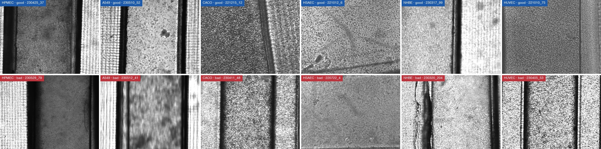
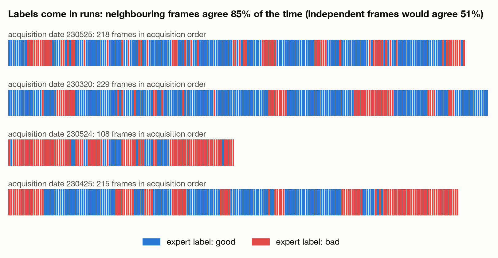
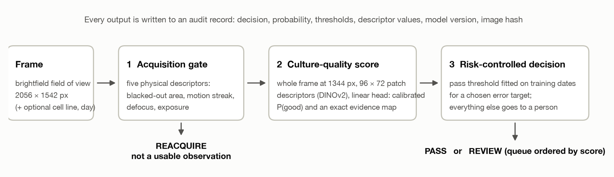
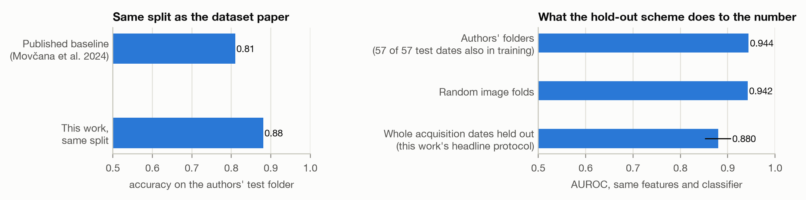
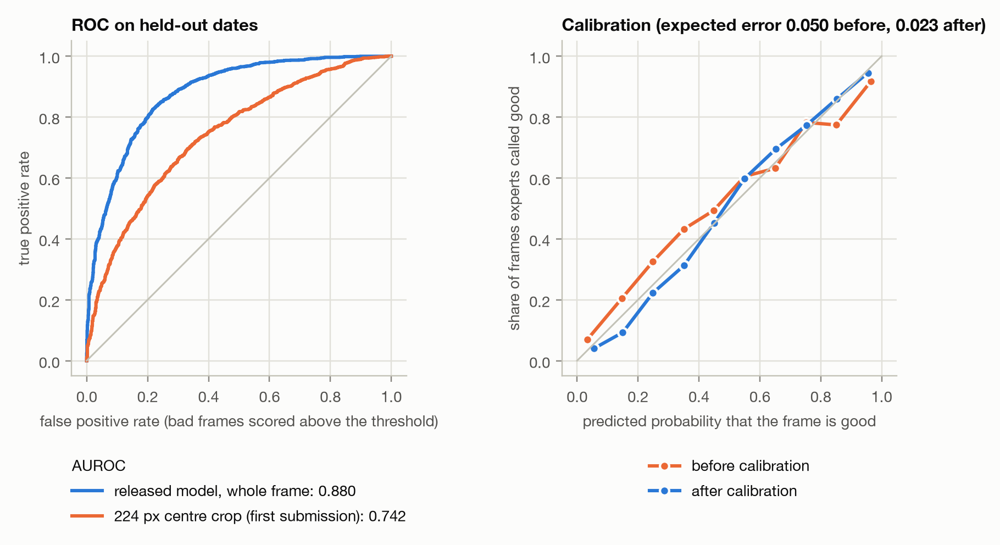
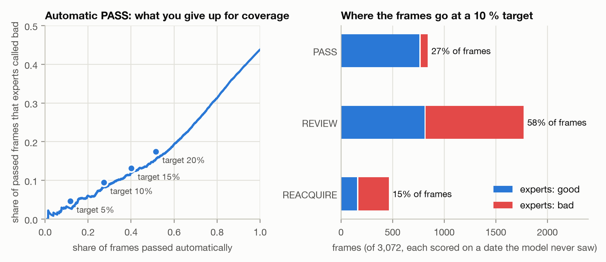
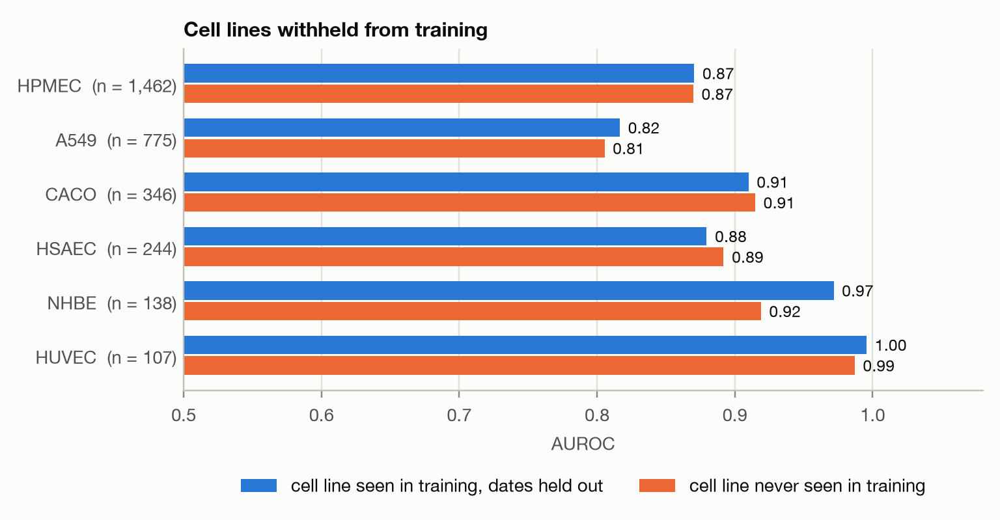
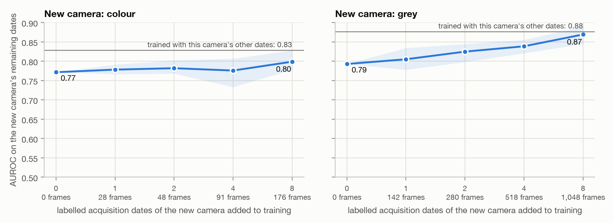
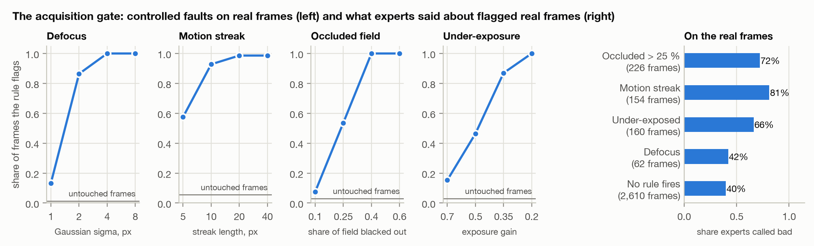
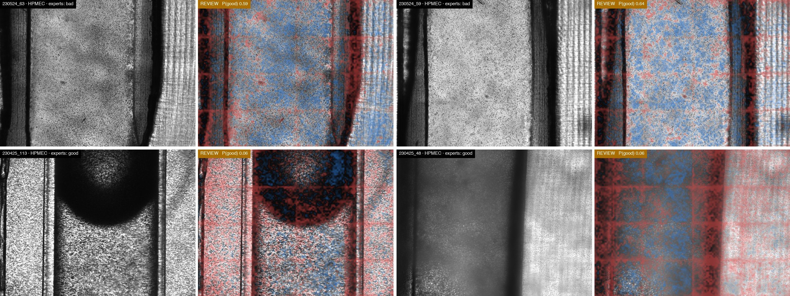

# ChipQC Guardian: an auditable quality gate for organ-on-a-chip brightfield imaging

**AI4S Open Innovation: AI for Life Science · Submission category: End-to-End System**

**Team:** Yi Yu, New York University (individual entry). No cross-disciplinary bonus is claimed.

**Code, model, features and results:** https://github.com/yy5652-hash/chipqc-guardian-ai4s

## Summary

Before an organ-on-a-chip (OoC) culture is dosed, stained or measured, someone looks at brightfield frames and decides whether the culture is usable. That decision is made by eye, differs between people and is rarely recorded. ChipQC Guardian turns it into a logged, checkable step. For every frame it returns one of three outcomes: **PASS** (use it without a person looking), **REACQUIRE** (the frame is not a usable observation) or **REVIEW** (a person decides, most suspicious frames first), together with the evidence behind the outcome.

The system has three parts. An *acquisition gate* computes five physical descriptors and sends occluded, streaked, defocused or under-exposed frames back to the microscope. A *culture-quality model* reads the whole 2056 × 1542 px frame at 1792 × 1344 px through a frozen self-supervised vision transformer (DINOv2 ViT-S/14) and a linear classifier on the unit-length mean of its last-four-block patch descriptors; because the classifier is linear in that mean up to one scale factor per frame, each of the 12,288 patches has an exact share of the score, which we draw as an evidence map. A *risk-controlled decision* passes a frame automatically only above a threshold fitted, on other acquisition dates, to keep the share of bad frames among passed frames under a chosen target.

We evaluate on the public Organ-on-a-Chip Image Dataset (3,072 frames, six cell lines, 59 acquisition dates, expert good/bad labels) and hold out **whole acquisition dates**, because frames from one date are not independent. Under that protocol the model reaches an AUROC of **0.880** (95 % interval 0.851–0.907), against 0.852 for our second submission and 0.742 for the 224 px centre-crop representation of our first; scored on the same resampled dates, the gain over the second submission is 0.027 (0.013 to 0.042). On the dataset authors' own split, where every test date also appears in training, the same features reach 0.88 accuracy (published baseline: 0.81). At a 10 % target the assembled system passes 27 % of frames automatically with 9.5 % bad among them, sends 15 % back for re-acquisition, and leaves 58 % to a person in order of suspicion; at a 20 % target 52 % pass. When a cell line is withheld from training its AUROC changes by at most 0.05 on any of the six lines, and performance drops on a different camera until local labels are added; we measure both.

Everything in this report is regenerated by two commands from released feature files, and every number in the text is injected from the result files those commands write.

## 1. Problem and application scenario

### 1.1 The decision we automate

Organ-on-a-chip systems culture human cells in perfused microchannels to reproduce tissue-level function, and are being adopted as alternatives to animal studies in drug development [1, 2]. In the United States the FDA Modernization Act 2.0 (2022) removed the statutory requirement for animal tests before human trials, and in April 2025 the FDA published a roadmap to reduce animal testing in favour of new approach methodologies, among them human-based laboratory models such as organoids and organ-on-a-chip systems [3, 4]. As these platforms move from single experiments to studies with hundreds of chips [2], routine quality control becomes a throughput and reproducibility problem.

The first quality question is simple and comes before every other measurement: *is this culture in a state worth analysing?* In practice a researcher inspects brightfield images of each chip at each time point and decides. The decision is subjective, it is seldom written down, and a wrong "yes" silently contaminates everything downstream: barrier measurements, imaging read-outs, dose-response curves, and any dataset later used to train models or digital twins. A wrong "no" discards days of culture and reagents.

ChipQC Guardian addresses that one decision. It does not judge viability, barrier function, toxicity or drug response, and it does not replace the biologist. It answers three narrower questions that can be checked against data:

1. Is this frame a usable observation of the culture at all (in focus, not smeared, not half outside the illuminated channel)?
2. If it is, how likely is it that an expert would call this culture good?
3. Is that likelihood high enough that nobody needs to look?

### 1.2 Who uses it and what changes

The user is a researcher or core-facility operator who images OoC chips in runs of tens to hundreds of frames. Today each frame costs a look. With the system, frames above the pass threshold need no look, frames that fail the acquisition gate go straight back to the microscope while the chip is still on the stage, and the remaining frames arrive as a queue ordered by score with the evidence attached. Every outcome is written to an audit record (decision, probability, thresholds, descriptor values, model version, image hash), so the quality state of each frame becomes a piece of metadata that travels with the data instead of a memory in someone's head.

### 1.3 Related work

Machine-learning quality control of microscopy has mostly targeted focus and imaging artefacts in high-content screening. For organ-on-a-chip cultures the only public benchmark we know of is the dataset used here. Its authors trained a convolutional network on a random split of the images (accuracy 0.81) [6]; George and Kenry classified a 631-image subset from Inception-v3 embeddings, again with a random split [12]. Neither separates acquisition dates, reports calibrated probabilities or a decision rule, or tests unseen cell lines or instruments. What is new here is a quality gate whose every decision can be checked, built on four ideas that, to our knowledge, have not been brought to organ-on-a-chip imaging before: an evidence map that is exact by construction, because the classifier is linear in the mean of the patch descriptors; a pass rule that carries a statistical safety margin and states the share of bad frames it lets through; a two-stage design that separates a frame that is not a usable observation from a culture that is poor, because the two call for different actions; and a validation that holds out whole acquisition dates, the unit at which these data are actually independent. Keeping the foundation model frozen is a deliberate choice, not a shortcut: it is what makes every explanation exact, and it lets a laboratory refit the system to its own instrument in seconds (section 7.3).

### 1.4 Contributions

- **An end-to-end, auditable quality gate** with three outcomes, a command-line tool, a review console and a browser demo, released with model, features and results.
- **A whole-frame, high-resolution, multi-depth representation.** Keeping the entire field of view at 1344 px instead of a 224 px crop raises date-held-out AUROC from 0.742 to 0.823 with the same backbone; a self-supervised transformer raises it to 0.852; reading the frame at 1792 px, describing each patch by the last four transformer blocks instead of the last one and scaling the frame embedding to unit length raise it to 0.880, and this representation also transfers best to a different camera.
- **Exact evidence maps.** The score decomposes additively over image patches by construction, so the explanation is the model's own arithmetic.
- **A validation protocol that matches how the data were produced.** Whole acquisition dates are held out; regularisation, calibration and thresholds are chosen inside the training dates; intervals resample dates. We quantify how much a random split flatters the same model (AUROC 0.942 against 0.880).
- **A decision rule that states its own error rate**, and an explicit negative result: automatic rejection is not supported by the data and is therefore not part of the system.
- **Stress tests that define the system's boundary:** cell lines withheld from training (at most 0.05 AUROC lost on any of six), a different camera (a clear loss, with the labelling cost of repairing it), and controlled acquisition faults.

## 2. Data

### 2.1 Source, licence and compliance

All experiments use the Organ-on-a-Chip (OOC) Image Dataset of Movčana et al. [5, 6], published on Zenodo under CC BY 4.0. It contains brightfield images acquired by an automated microscope from OoC cultures of six human cell lines, with a class label ("good" or "bad" sample quality as assessed by a biology expert), the cell type, the time after seeding and, for some images, seeding density and flow rate. The data are images of commercially available cell lines; they contain no personal, patient or clinical information. We verified the 6.7 GB archive against its published MD5 checksum, matched all 3,072 spreadsheet rows to exactly one decodable image, and confirmed that the folder label of every image agrees with the spreadsheet label.

We redistribute only derived material, with attribution: the feature vectors of all frames, 144 px grey thumbnails used to show similar reference frames, and nine example frames. The full images must be downloaded from Zenodo.

| Cell line | Tissue | Frames | Good | Bad | Acquisition dates |
|---|---|---|---|---|---|
| HPMEC | pulmonary microvascular endothelium | 1,462 | 798 | 664 | 29 |
| A549 | alveolar epithelium (adenocarcinoma) | 775 | 537 | 238 | 24 |
| Caco-2 | intestinal epithelium | 346 | 109 | 237 | 17 |
| HSAEC | small-airway epithelium | 244 | 163 | 81 | 21 |
| NHBE | bronchial epithelium | 138 | 105 | 33 | 6 |
| HUVEC | umbilical-vein endothelium | 107 | 15 | 92 | 4 |
| **Total** | | **3,072** | **1,727** | **1,345** | **59** |



### 2.2 Three properties of the data that shape the method

**Frames are not independent.** Image IDs have the form `YYMMDD_N`: an acquisition date and the position of the frame in that day's run. Neighbouring frames in a run show neighbouring fields of the same chip, and their labels agree 85 % of the time (independent frames would agree 51 %); the median run of identical labels is 2 frames and the mean 6.1. Ten dates contain only good frames and four only bad ones. A model can therefore score well on a random split by recognising the day. The authors' own train/validation/test folders are such a split: all 57 dates in their test folder also occur in training.



**"Bad" mixes two different things.** Looking at label changes inside a run shows that experts marked frames bad both when the *culture* looked wrong (sparse or detached cells, patchy coverage) and when the *image* was not a usable observation (motion smear, a field half outside the illuminated channel, defocus). These call for different actions: a poor culture is a biological finding, a poor image should be taken again. This is why the system has two stages.

**Two cameras.** 2,048 frames are 2056 × 1542 px greyscale and 1,024 are colour frames (2048 × 1536 px, a few at 640 × 480 px) from a second camera, with different label proportions. We treat the camera as a stress test in section 5.6.

## 3. System



### 3.1 Acquisition gate

The gate works on the grey frame at 1024 × 768 px and computes five quantities an operator can verify by looking at the image:

| Descriptor | Definition | Rule |
|---|---|---|
| Blacked-out share | share of 32 × 32 px blocks whose mean brightness is below 0.12 | re-acquire above 0.25 |
| Motion streak | anisotropy of gradient energy, abs(Ex − Ey) / (Ex + Ey) | re-acquire above 0.37 |
| Local sharpness | log10 of the median Laplacian variance over lit blocks | re-acquire below -3.39 |
| Median brightness | median grey level | re-acquire below 0.25 |
| Clipped highlights | share of pixels above 0.97 | reported only |

The blacked-out limit is a fixed physical choice. The streak and brightness limits are the 5 % tails and the sharpness limit the 2 % tail of the reference frames; they are stored in the model file and can be re-fitted for another microscope. Clipped highlights are reported but never trigger re-acquisition: an empty, sparsely covered channel is bright for biological reasons, and judging that is the model's job.

### 3.2 Culture-quality model

**Representation.** The frame is resized to 1792 × 1344 px (a 0.87× downscale that keeps the whole field of view) and cut into 4 × 4 non-overlapping tiles of 448 × 336 px. Each tile passes through DINOv2 ViT-S/14 with registers [7, 8], a vision transformer trained without labels on 142 million images and used here with frozen weights. Every 14 × 14 px patch is described by its tokens after each of the last four transformer blocks, 4 × 384 = 1,536 numbers: the last block alone describes what a patch is, the earlier ones keep more of its texture, and section 5.3 shows that the classifier uses both. A frame is described by 12,288 such descriptors, and the frame embedding is their mean.

**Classifier.** An L2-regularised logistic regression on the standardised, unit-length embedding: the mean descriptor x is first scaled to unit length, x / ‖x‖. With mean μ, scale σ, weights w and intercept b fitted on the training frames, the log-odds of a frame with patch descriptors f_1 … f_N is

`logit = b + Σ_c w_c (x_c / ‖x‖ − μ_c) / σ_c = (1/N) Σ_i [ v · f_i / ‖x‖ + b′ ]`, with `x = mean_i f_i`, `v = w / σ` and `b′ = b − Σ_c w_c μ_c / σ_c`.

**Exact evidence map.** The right-hand side is an average over patches. The term `v · f_i / ‖x‖ + b′` is patch *i*'s share of the frame's log-odds: positive where the patch pulls the score towards "good", negative towards "bad". The norm ‖x‖ is one number per frame, so it scales every patch's share equally, and drawing these values over the frame gives a map that averages exactly to the score. Scaling the embedding to unit length is a change of the head, not of the representation; on held-out dates it adds 0.008 AUROC to the released representation (section 5.3). No gradient, perturbation or surrogate model is involved, so the map cannot disagree with the prediction it explains. It explains the model, not the biology: it shows where the model found its evidence, which a reviewer can then judge.

**Calibration.** A two-parameter logistic (Platt) map [9] is fitted to out-of-fold log-odds and applied to the score, so that "0.8" means that about 80 % of such frames were called good by experts on dates the model had not seen (section 5.3).

### 3.3 Risk-controlled decision

For a target error α chosen by the laboratory (10, 15 or 20 %), the pass threshold is the lowest calibrated probability such that, among frames at or above it that also passed the acquisition gate, the share labelled bad stays at or below α with a safety margin: we require the one-sided 90 % Wilson upper bound of that share, not the share itself, to be at most α. Picking the largest set that just meets a target on the fitting data is optimistic; the margin pays for that. The threshold is fitted on out-of-fold predictions of training dates only. Frames above the threshold are passed; all others go to review, ordered by score, with a "likely bad" hint below 0.5. This is selective classification [10] with the threshold chosen for a stated error rather than for accuracy.

There is deliberately **no automatic FAIL**. We built it, measured it on unseen dates and removed it (section 5.4): low scores were right too rarely for a decision that discards a culture.

### 3.4 Context for the reviewer and the audit record

For each frame the console shows the three most similar good and bad reference frames (cosine similarity of standardised embeddings), so a reviewer sees what the model is comparing against. Each assessment is exported as a record:

```
frame, decision, p_good, reason, occluded_block_frac, streak_anisotropy, log_sharpness,
median_brightness, saturated_frac, pass_threshold, error_target, model, model_created_utc,
sha256, assessed_utc
```

### 3.5 Implementation


The system is a small Python package (`src/chipqc`, 644 lines) with three entry points: `inference.py` (a folder of frames in, audit records and evidence maps out), `app.py` (a Streamlit review console) and `evaluate.py` (all experiments). A released model is a folder with a JSON file (classifier weights, calibrator, thresholds, acquisition limits, evaluation summary) and one array file of reference embeddings; nothing is pickled. One frame takes 0.26 s on a laptop GPU and 0.86 s on a laptop CPU. A static browser demo (https://yy5652-hash.github.io/chipqc-guardian-ai4s/) runs the same pipeline on the visitor's machine: the frame reading and descriptors are ported to JavaScript with Pillow-compatible resampling, and the backbone, classifier and calibrator are exported as one ONNX graph. In headless Chromium its P(good) on the bundled frames differs from the Python reference by at most 0.000003, at about 13 s per frame on a CPU through WebAssembly.

## 4. Experimental design

**Primary protocol.** Five folds over the 59 acquisition dates, repeated three times with different fold assignments; each frame's reported probability is the mean over repeats of predictions from models that never saw its date. Inside every training set a second date-grouped cross-validation (four folds) chooses the regularisation strength from {0.001, 0.003, 0.01, 0.03, 0.1}, fits the calibrator and chooses the pass threshold. Nothing is tuned on the dates being scored.

**Uncertainty.** All 95 % intervals are percentile intervals from 2,000 bootstrap resamples of *dates*, not frames. With 85 % label agreement between neighbouring frames, frame-level intervals would be far too narrow.

**Metrics.** AUROC and balanced accuracy for discrimination; Brier score and expected calibration error for probabilities; for the decision rule, the share of frames passed automatically and the share of bad frames among them.

**Comparisons.** (i) The representation of our first submission (MobileNetV2, 224 px centre crop). (ii) The same backbone on the whole frame at 672, 1344 and 2048 px. (iii) Other frozen backbones on the whole frame: ResNet-50, ConvNeXt-Tiny [11], and DINOv2 at three tilings, two model sizes and two depths of read-out (the last block, or the last four). (iii-b) Our second submission as released, and the released representation under its head, which did not scale the embedding to unit length. (iv) No-image baselines: cell line and culture day only; the five acquisition descriptors only. (v) The published protocol: the authors' own split, for comparison with the published baseline.

**Stress tests.** Leave-one-cell-line-out; training on one camera and testing on the other, with 0 to 8 labelled dates of the new camera added; controlled defocus, motion, occlusion and under-exposure applied to real frames.

**What was selected on these results.** This is not a pre-registered test, and we list what the evaluation itself shaped. The backbone and the input resolution were chosen by comparing representations under the primary protocol. The released representation is the third we have submitted, and it was chosen after the second had been scored on these same 59 dates: we tried about fifty variants of a linear read-out from frozen features (concatenated backbones, per-date and per-camera normalisation, smoothing over neighbouring frames, mean, standard-deviation and class-token pooling, single earlier blocks, the last two, four, six, eight and twelve blocks, 3 × 3 and 4 × 4 tiles, larger backbones, PCA whitening, a linear SVM, class weighting, unit-length patch tokens, averaging over flipped copies of the frame, and scaling the frame embedding to unit length) and kept the one that scored best among those a browser can still run and that keep the evidence map exact. Unit-length scaling of the frame embedding helped every DINOv2 representation we tried it on by 0.004 to 0.008, which is why we trust it more than a single comparison would justify; six blocks instead of four, unit-length patch tokens and flip averaging each changed the result by less than 0.005, within noise, and are not part of the system. Its advantage over the second submission is therefore an optimistic estimate: the interval of the difference excludes zero, but it is not corrected for that search, and only new acquisition dates can confirm it. The normalisation and neighbour-smoothing variants did not help and are not part of the system. The safety margin of the pass rule and the removal of automatic rejection were decided after seeing the rule's behaviour on held-out dates. The cell-line, camera and acquisition-fault tests were run once, on the released representation, and did not influence any choice.

## 5. Results

### 5.1 Headline

| Measure (dates held out, 3,072 frames, 59 dates) | Value | 95 % interval |
|---|---|---|
| AUROC | 0.880 | 0.851–0.907 |
| Balanced accuracy at 0.5 | 0.802 | 0.765–0.830 |
| Accuracy at 0.5 | 0.808 | 0.785–0.834 |
| Brier score | 0.138 | 0.123–0.151 |
| Expected calibration error, before / after calibration | 0.050 / 0.023 | |

On the frozen 12-date test split published with our first submission, where that version scored an AUROC of 0.772 and our second 0.859, the released model reaches 0.885 (0.801–0.934) when fitted on the other 47 dates and scored once.

No-image baselines stay near chance: cell line and culture day alone reach an AUROC of 0.511, the five acquisition descriptors alone 0.632. The model works at every culture age, including the first day after seeding, when a failing culture is cheapest to replace:

| Time after seeding | Frames | AUROC (dates held out) |
|---|---|---|
| 0–1 days | 852 | 0.847 |
| 2–3 days | 798 | 0.900 |
| 4 days | 223 | 0.841 |
| more than 4 days | 1,199 | 0.861 |

### 5.2 The hold-out scheme decides what the number means



On the authors' split our features reach 0.881 accuracy, 0.873 precision and 0.921 recall on 656 test frames, against 0.81, 0.79 and 0.78 reported with the dataset [6]; a later study on a 631-image subset of two cell lines reports about 0.83 accuracy for a four-class version of the task with a random 70/30 split [12]. These numbers are comparable with each other, but they are not estimates of performance on a new imaging day: the AUROC falls from 0.944 on the authors' split to 0.880 when whole dates are held out. We report the lower number as our result.

### 5.3 What moves the result: the whole frame, at resolution, with self-supervised features


| Representation | AUROC | 95 % interval | Difference from the released model (95 % interval of the difference) | Passed at a 10 % target |
|---|---|---|---|---|
| MobileNetV2, 224 px centre crop (first submission) | 0.742 | 0.700–0.792 | −0.137 (−0.178 to −0.095) | 1 % |
| MobileNetV2, whole frame, 672 px | 0.795 | 0.765–0.831 | −0.085 (−0.108 to −0.059) | 10 % |
| MobileNetV2, whole frame, 1344 px | 0.823 | 0.787–0.861 | −0.056 (−0.080 to −0.033) | 16 % |
| MobileNetV2, whole frame, 2048 px (native) | 0.815 | 0.781–0.852 | −0.065 (−0.085 to −0.045) | 14 % |
| ResNet-50, whole frame, 1344 px | 0.820 | 0.779–0.860 | −0.060 (−0.087 to −0.035) | 12 % |
| ConvNeXt-Tiny, whole frame, 1344 px | 0.846 | 0.819–0.877 | −0.033 (−0.051 to −0.017) | 22 % |
| DINOv2 ViT-S/14, whole frame at 896 px, 2 × 2 tiles | 0.836 | 0.798–0.874 | −0.044 (−0.071 to −0.020) | 16 % |
| DINOv2 ViT-S/14, 1344 px, 3 × 3 tiles, last block, head without normalisation (second submission as released) | 0.852 | 0.821–0.883 | −0.027 (−0.042 to −0.013) | 18 % |
| DINOv2 ViT-S/14, whole frame at 1344 px, 3 × 3 tiles | 0.857 | 0.826–0.887 | −0.023 (−0.037 to −0.010) | 19 % |
| DINOv2 ViT-B/14, whole frame at 1344 px, 3 × 3 tiles | 0.861 | 0.830–0.891 | −0.018 (−0.036 to −0.003) | 19 % |
| DINOv2 ViT-S/14, whole frame at 1792 px, 4 × 4 tiles | 0.865 | 0.834–0.895 | −0.015 (−0.026 to −0.004) | 25 % |
| DINOv2 ViT-S/14, 1344 px, 3 × 3 tiles, last four blocks | 0.867 | 0.837–0.895 | −0.013 (−0.024 to −0.003) | 24 % |
| DINOv2 ViT-S/14, 1792 px, 4 × 4 tiles, last four blocks, head without normalisation | 0.872 | 0.842–0.900 | −0.008 (−0.013 to −0.003) | 27 % |
| **DINOv2 ViT-S/14, 1792 px, 4 × 4 tiles, last four blocks, unit-length embedding (released model)** | 0.880 | 0.851–0.907 | (reference) | 28 % |

Four steps account for the gain over our first submission. Showing the model the whole frame instead of its centre, and at four times the linear resolution, is worth 0.081 AUROC with an unchanged backbone. A stronger supervised backbone adds a little. Self-supervised features add slightly more on held-out dates and transfer better to another camera (section 5.6). The fourth step is new in this version: a finer tiling, a deeper read-out of the same frozen backbone, and a unit-length frame embedding.

The fourth column scores each representation and the released model on the same resampled dates, which is a sharper comparison than setting two intervals side by side. Every row uses the released head, which scales the frame embedding to unit length, except the two rows marked "without normalisation", which use the head of our second submission. Those two rows isolate the head: the change is worth 0.004 on the second submission's representation and 0.008 on the released one. The other rows isolate the representation. With the released head, reading 4 × 4 tiles at 1792 px with the last block only leaves the model 0.015 below the released one; describing each patch by the last four blocks at the old resolution leaves it 0.013 below; the second submission's representation is 0.023 below, and the second submission as released 0.027 below, with an interval of the difference that excludes zero. The larger ViT-B model with the last block only, at four times the parameters, is 0.018 below. The released configuration costs 16 tiles per frame instead of 9 and no additional parameters, so a browser can still run it. Section 4 states how far the ranking of these rows can be trusted.



### 5.4 The decision rule on unseen dates



| Target (bad among passed) | Passed automatically | Bad among passed (measured) | Sent to re-acquire | Left for a person |
|---|---|---|---|---|
| 5 % | 12 % | 4.6 % | 15 % | 73 % |
| 10 % | 27 % | 9.5 % | 15 % | 58 % |
| 15 % | 40 % | 13.2 % | 15 % | 45 % |
| 20 % | 52 % | 17.5 % | 15 % | 33 % |

At every target the measured share of bad frames among passed frames stays at or below the target, although every threshold was fitted on other dates. The 5 % target is met only narrowly (4.6 %) and on 12 % of frames, too few for the margin to be trusted; the console therefore offers 10, 15 and 20 %. The acquisition gate fires on 15 % of frames, and experts had labelled 66 % of those bad (against 44 % overall). Within the review queue the score still orders frames usefully (AUROC 0.82): a reviewer who starts at the low end meets 54 % of the queue's bad frames in its first third.

**Why there is no automatic FAIL.** Choosing a fail threshold the same way gives, at a 10 % target, a set of 10 % of frames of which 12 % were good: above the target, for a decision that discards a culture. Once frames with acquisition faults are removed, low scores on a new date are not reliable enough to discard a culture, so those frames go to a person.

### 5.5 Cell lines the model has never seen



Excluding a cell line from training changes its AUROC by at most 0.05 on any of the six lines; the largest change is on NHBE, from 0.97 to 0.92. The model was never shown a single frame of the held-out line, yet it ranks that line's cultures nearly as well as when the line is in training. This suggests that the self-supervised descriptors capture cues shared across epithelial and endothelial monolayers (coverage, texture regularity, detachment) rather than line-specific appearance, and it is the property a quality gate needs most when a laboratory brings in a new cell type. The ImageNet-supervised ConvNeXt-Tiny lost far more on the same line: withholding NHBE lowered its AUROC from 0.91 to 0.69. Two cautions apply: A549 is the hardest line in both settings (0.82), and HUVEC and NHBE come from only 4 and 6 dates.

### 5.6 A different camera

Trained on one camera and tested on the other, the model loses about six to eight points of AUROC. Adding labelled sessions from the new camera repairs the loss gradually: with eight dates (about 176 colour or 1,048 grey frames) the grey camera is back near its within-camera level and the colour camera is about half of the way there. The supervised ImageNet backbones transfer worse than the self-supervised one: on the whole frame they reach 0.58–0.70 from grey to colour and 0.64–0.72 from colour to grey, against 0.77 and 0.79; the 224 px crop of our first submission reaches 0.53 and 0.55. The consequence for deployment is stated in section 6: a new instrument needs local reference frames, and the system should start in review-only mode there.



| Training data | Test: colour camera | Test: grey camera |
|---|---|---|
| Same camera, other dates (primary protocol) | 0.828 | 0.877 |
| Other camera only | 0.772 | 0.793 |
| Other camera + 2 labelled dates of this one | 0.782 | 0.825 |
| Other camera + 8 labelled dates of this one | 0.799 | 0.869 |

### 5.7 The acquisition gate



Applied to 360 real frames (60 per cell line), the rules catch 86 % of frames defocused with a 2 px Gaussian and all at 4 px, 93 % of 10 px motion streaks, all frames with 40 % of the field blacked out, and 87 % of frames at 0.35× exposure, while firing on 9.2 % of the untouched frames. On the real data, 154 frames trip the streak rule and 81 % of them carry a "bad" label; for occlusion the figure is 72 %. The defocus rule is the weakest link on real data (42 % labelled bad, no different from the average): low local sharpness also occurs in sparse but correctly focused cultures.

### 5.8 What the evidence maps show


In the confluent culture the positive evidence sits on the cell layer inside the channel. In the poor culture the negative evidence covers the dark, blotchy stretches of the channel. In the smeared frame it follows the streaks; in the occluded frame the blacked-out band itself draws positive evidence, which is one reason such frames are handled by the acquisition gate and never by the model. The maps also expose two things a reviewer should know. Structures outside the culture area (channel walls, the textured chip body) receive non-zero evidence in some frames, so the model is not looking at cells alone. And the maps show faint rectangular steps at tile borders: each patch descriptor carries context from its whole tile, so part of the evidence is tile-level rather than local. We show both rather than smooth them away, because this is the information a reviewer needs in order to decide how far to trust a score.

### 5.9 Where the model and the experts disagree



The two highest-scored frames that experts labelled bad show an even, confluent-looking HPMEC layer; both scored near 0.6, stayed below the pass threshold and went to review. The two lowest-scored frames that experts labelled good are a blurred, low-contrast field and a field with a large dark air bubble across the channel. A single frame cannot settle who is right. The label may reflect knowledge about the chip that is not visible in this field (labels run over neighbouring frames, section 2.2), and in both low-scored frames the model is reacting to something that is really there in the image. These cases are why the system keeps a person in the loop for everything except confident passes.

## 6. Reliability and limitations

- **One laboratory, one chip family.** All frames come from one group's platform. Performance on other chip designs, magnifications or illumination is unknown; the camera experiment shows that an instrument change alone is enough to require local labels.
- **Labels are one group's judgement.** The label is an expert's good/bad call, not a functional measurement, and no per-expert votes are published, so the model's errors include cases where experts would disagree with each other. A PASS means "experts in this dataset would probably have called it good", nothing more.
- **Dates are a proxy.** The first six characters of the image ID separate acquisition days, not verified chips or donors. Holding out dates removes the leakage we could identify [13, 14]; it does not prove independence at the chip level.
- **Few independent units.** 59 dates, of which 14 are single-class, give wide intervals. The headline interval spans 0.055 AUROC.
- **The error target is empirical.** Thresholds met their targets on held-out dates in this dataset. This is evidence, not a guarantee, and it must be re-checked after any change of instrument, protocol or cell line.
- **No automatic rejection, by design, and no 5 % target offered.** The data support passing frames at a 10 % target or looser; they do not support discarding cultures automatically, and the 5 % target is met only narrowly and on few frames, so it is not offered.
- **The evidence map explains the model.** It is exact with respect to the classifier, but the patch descriptors come from a deep network: the map shows where the evidence is, not which biological property produced it.
- **Not validated prospectively and not for clinical or regulatory decisions.**

## 7. Potential impact and path to use

### 7.1 What changes for the laboratory

A laboratory imaging OoC chips can run the tool on each acquisition folder as it is written. At a 10 % target and on dates the model had not seen, per 1,000 frames about 274 need no inspection, about 151 are returned to the microscope with a stated reason while re-imaging is still possible, and about 576 are reviewed in order of suspicion. The laboratory chooses the target; at 20 % about 516 frames per 1,000 pass.

**Time.** The dataset does not record how long an expert spends on a frame, so the saving below is an estimate under a stated assumption, not a measurement. We assume 10 or 30 seconds per frame to open the image, judge the culture and record the call; a laboratory should substitute its own figure, and the saving scales linearly with it.

| Target (bad among passed) | Frames per 1,000 that need no look | Bad among them (measured) | Looking avoided per 1,000 frames, at 10 s per frame | The same, at 30 s per frame |
|---|---|---|---|---|
| 10 % | 274 | 9.5 % | 46 min | 137 min |
| 15 % | 401 | 13.2 % | 67 min | 201 min |
| 20 % | 516 | 17.5 % | 86 min | 258 min |


**Errors.** We cannot claim that the gate makes fewer mistakes than a person: the dataset has one label per frame and no second rater, so the human error rate is unknown. What changes is that the automatic part has a measured error rate, written into every record, where today there is none. The frames that still need a person also arrive in a useful order: within the review queue at a 10 % target the score still separates good from bad (AUROC 0.82), so a reviewer who only has time for the first third of the queue meets 54 % of its bad frames rather than a third of them.

**Time points that would be lost.** A frame that is unusable but noticed only at analysis cannot be taken again, because the culture has moved on: the time point is lost. The acquisition gate flags 15 % of frames while the chip is still on the stage, experts had labelled 66 % of those bad (against 44 % of all frames), and re-imaging costs one more exposure.

### 7.2 A quality layer for organ-on-a-chip data assets and digital twins

The long-term direction of this challenge is an AI-driven digital twin of organ-on-a-chip systems, built on accumulated chip data and moving the field from describing experiments to predicting them. Models of that kind learn from whatever frames they are given. In this dataset experts judged 44 % of frames bad, and section 2.2 showed that "bad" mixes failed cultures with failed images. A model trained on an archive without that distinction treats a smeared frame of a healthy culture and a sharp frame of a detached one alike, and can learn acquisition artefacts as biology. Quality control is therefore not an add-on to a data asset but its first layer, and the audit record is designed to be that layer:

- **A decision and a calibrated probability.** A training set can be filtered at a stated contamination level (frames passed at a 10 % target were 9.5 % bad on unseen dates), or every frame can be kept and weighted by P(good) instead of discarded.
- **Five acquisition descriptors.** A downstream model can take focus, streak, occlusion and exposure as covariates, so that drift in imaging is not mistaken for an effect of a compound or of time.
- **Model version and image hash.** Each decision is tied to the exact bytes it was made on and to the model that made it, so it can be traced, audited and recomputed when the model changes. Re-scoring is cheap: at 0.86 s per frame on a laptop CPU the whole 3,072-frame archive is scored again in about 44 minutes (13 on a laptop GPU).

**From frames to chips.** The record describes a frame, while a twin models a chip over time. With chip and channel identifiers, which the public dataset does not contain, the same records add up to a quality time course for each chip: when a culture first scores low, whether it recovers, and which time points have to be imaged again.

**Other tissues, including neural models.** The withheld-cell-line experiment is evidence of transfer across epithelial and endothelial monolayers (section 5.5). It is not evidence for tissues with a different morphology, such as neuronal networks or three-dimensional organoids, and we make no such claim. Because the backbone is frozen and the classifier has 1,536 weights, finding out costs labelled reference frames rather than a training run; section 7.3 gives the procedure.

### 7.3 Adoption on a new platform

Adapting the system to a new microscope or tissue means labelling reference frames and refitting in seconds, not training a network. The camera experiment (section 5.6) gives a first estimate of the labelling cost, and the recommended procedure follows from it:

1. **Review-only mode.** Every frame goes to a person, and the console records their decisions, which become the local reference labels. Nothing is passed automatically.
2. **Refit.** In the camera experiment, two labelled sessions of the new camera raised AUROC from 0.772 to 0.782 on the colour camera and from 0.793 to 0.825 on the grey one; with eight sessions (about 176 colour or 1,048 grey frames) the grey camera was back near its within-camera level. The acquisition limits are percentile tails of the reference frames and are refitted at the same time.
3. **Automatic passing.** Switch it on only when held-out sessions of the new platform meet the chosen target, and check again after any change of instrument, protocol or cell line.

### 7.4 What would make it stronger

Per-expert labels to measure the agreement ceiling; chip and channel identifiers to move from frames to chips; data from a second laboratory and from other tissues; and a prospective study that replaces the assumed seconds per frame of section 7.1 with measured review time and compares downstream assay quality with and without the gate.

## 8. Reproducibility

```
git clone https://github.com/yy5652-hash/chipqc-guardian-ai4s && cd chipqc-guardian-ai4s
python -m venv .venv && . .venv/bin/activate && pip install -r requirements.txt
python evaluate.py                 # every number in this report
python scripts/make_figures.py     # every chart
python scripts/build_report.py     # this report
python inference.py examples/      # the released model on the bundled frames
streamlit run app.py               # the review console
```

`evaluate.py` needs no images: the repository ships the embeddings of all 3,072 frames for every representation in section 5.3 and the acquisition descriptors. `scripts/reproduce_from_images.sh` rebuilds those files from the Zenodo archive (download, checksum, manifest, embeddings, descriptors), which takes about 20 minutes on a laptop GPU. The full evaluation takes about 3 minutes on an Apple-silicon desktop and much longer on a small cloud machine, where `python evaluate.py --only headline` reproduces the headline numbers by themselves. The report itself is generated: `scripts/build_report.py` fills this text from `results/*.json`, so a number cannot drift from the result file that produced it. The test suite (`pytest`) covers the date folds, the acquisition rules, the exactness of the evidence map, the threshold rule and the nested protocol; `scripts/check_web_demo.py` checks the browser demo against the Python reference. We also verified the released requirements file in a fresh virtual environment: the tests pass and `evaluate.py` writes the result files this report quotes.

| External asset | Use | Licence |
|---|---|---|
| Organ-on-a-Chip Image Dataset, Movčana et al., Zenodo 10.5281/zenodo.10203721 | all training and evaluation | CC BY 4.0 |
| DINOv2 ViT-S/14 with registers (Meta AI), via timm | frozen backbone of the released model | Apache-2.0 |
| MobileNetV2, ResNet-50, ConvNeXt-Tiny ImageNet weights, via torchvision | ablations only | BSD-3-Clause (torchvision) |
| PyTorch, timm, scikit-learn, NumPy, pandas, Pillow, Streamlit, ONNX Runtime | implementation | BSD / Apache-2.0 / MIT / HPND |

**AI tools.** AI coding assistants were used to write code and to draft and edit text under the author's direction; all experiments were run and all numbers were produced by the released scripts. The narration of the demo video is a synthetic voice.

## Appendix A. Every acquisition date

Out-of-fold results for each of the 59 dates under the primary protocol. "Good" is the share of frames experts labelled good; "mean P" is the mean predicted probability of good; AUROC is given where a date contains both classes.

| Date | Camera | Cell lines | Frames | Good | Mean P | AUROC |
|---|---|---|---|---|---|---|
| 220429 | colour | HPMEC, HSAEC | 31 | 77% | 0.69 | 0.99 |
| 220502 | colour | HSAEC | 8 | 100% | 0.74 | one class |
| 220503 | colour | HSAEC | 8 | 50% | 0.76 | 1.00 |
| 220506 | colour | CACO, HSAEC | 15 | 47% | 0.78 | 0.71 |
| 220512 | colour | CACO, HSAEC | 15 | 53% | 0.44 | 0.93 |
| 220515 | colour | CACO, HSAEC | 12 | 83% | 0.83 | 0.85 |
| 220526 | colour | HSAEC | 6 | 50% | 0.35 | 0.33 |
| 220606 | colour | A549, CACO | 21 | 48% | 0.43 | 0.65 |
| 220608 | colour | A549, CACO | 23 | 0% | 0.35 | one class |
| 220609 | colour | A549, CACO | 16 | 69% | 0.80 | 0.84 |
| 220610 | colour | A549, CACO | 24 | 75% | 0.90 | 0.81 |
| 220611 | colour | A549, CACO | 24 | 75% | 0.73 | 0.70 |
| 220612 | colour | A549, CACO | 24 | 83% | 0.72 | 0.89 |
| 220620 | colour | A549 | 12 | 92% | 0.69 | 1.00 |
| 220626 | colour | HPMEC, HSAEC | 16 | 100% | 0.64 | one class |
| 220630 | colour | HSAEC | 19 | 16% | 0.42 | 0.92 |
| 220706 | colour | HSAEC | 10 | 40% | 0.39 | 1.00 |
| 220708 | colour | HPMEC, HSAEC | 13 | 54% | 0.26 | 1.00 |
| 220715 | colour | HPMEC, HSAEC | 15 | 80% | 0.79 | 0.78 |
| 220716 | colour | HSAEC | 9 | 100% | 0.82 | one class |
| 220718 | colour | HSAEC | 9 | 0% | 0.30 | one class |
| 220721 | colour | HSAEC | 6 | 0% | 0.10 | one class |
| 220722 | colour | HSAEC | 9 | 33% | 0.38 | 1.00 |
| 220724 | colour | HSAEC | 9 | 11% | 0.36 | 0.62 |
| 221010 | colour | A549, HPMEC, HSAEC, HUVEC | 99 | 82% | 0.92 | 0.82 |
| 221012 | colour | HSAEC | 24 | 100% | 0.62 | one class |
| 221123 | colour | A549 | 12 | 17% | 0.75 | 0.20 |
| 221214 | colour | HPMEC | 18 | 100% | 0.82 | one class |
| 221215 | colour | A549, CACO, HUVEC | 22 | 91% | 0.73 | 0.45 |
| 221219 | colour | A549 | 17 | 35% | 0.64 | 0.76 |
| 230109 | colour | A549, HPMEC | 107 | 80% | 0.87 | 0.89 |
| 230110 | colour | A549 | 17 | 65% | 0.47 | 0.64 |
| 230119 | colour | HPMEC, HSAEC | 70 | 100% | 0.86 | one class |
| 230123 | colour | HPMEC, HSAEC | 26 | 85% | 0.79 | 0.78 |
| 230206 | colour | A549, HPMEC | 57 | 91% | 0.84 | 0.53 |
| 230214 | colour | HPMEC | 48 | 94% | 0.74 | 0.59 |
| 230215 | colour | HPMEC | 24 | 67% | 0.96 | 0.84 |
| 230216 | colour | HPMEC | 6 | 100% | 0.85 | one class |
| 230314 | colour/grey | HPMEC | 50 | 44% | 0.56 | 0.95 |
| 230315 | grey | HPMEC | 94 | 55% | 0.63 | 0.87 |
| 230316 | colour | A549, HPMEC, NHBE | 44 | 100% | 0.92 | one class |
| 230317 | grey | HPMEC, NHBE | 100 | 73% | 0.74 | 0.72 |
| 230320 | grey | A549, HPMEC, NHBE | 229 | 77% | 0.62 | 0.90 |
| 230321 | colour | A549, HPMEC | 16 | 100% | 0.98 | one class |
| 230328 | colour | CACO | 24 | 100% | 0.98 | one class |
| 230329 | colour | CACO | 12 | 83% | 0.73 | 0.75 |
| 230403 | colour | CACO | 12 | 25% | 0.42 | 0.74 |
| 230405 | grey | CACO, HUVEC | 138 | 0% | 0.25 | one class |
| 230411 | grey | CACO, HUVEC | 79 | 1% | 0.21 | 0.90 |
| 230419 | grey | CACO, HPMEC | 124 | 6% | 0.16 | 0.45 |
| 230424 | grey | A549, HPMEC | 108 | 51% | 0.59 | 0.76 |
| 230425 | grey | A549, CACO, HPMEC | 215 | 55% | 0.36 | 0.93 |
| 230510 | grey | A549, HPMEC, NHBE | 94 | 63% | 0.54 | 0.97 |
| 230512 | grey | A549, HPMEC, NHBE | 89 | 38% | 0.53 | 0.96 |
| 230517 | grey | A549, HPMEC, NHBE | 90 | 60% | 0.68 | 0.95 |
| 230523 | grey | HPMEC | 111 | 39% | 0.30 | 0.90 |
| 230524 | grey | HPMEC | 108 | 23% | 0.25 | 0.73 |
| 230525 | grey | A549, HPMEC | 218 | 69% | 0.66 | 0.83 |
| 230529 | grey | A549, HPMEC | 216 | 43% | 0.46 | 0.87 |

## References

1. Ingber DE. Human organs-on-chips for disease modelling, drug development and personalized medicine. *Nat Rev Genet* 23, 467–491 (2022).
2. Ewart L, et al. Performance assessment and economic analysis of a human Liver-Chip for predictive toxicology. *Commun Med* 2, 154 (2022).
3. FDA Modernization Act 2.0, enacted in the Consolidated Appropriations Act, 2023, Pub. L. 117-328 (2022).
4. U.S. Food and Drug Administration. Roadmap to Reducing Animal Testing in Preclinical Safety Studies (April 2025).
5. Movčana V, et al. Organ-on-a-Chip (OOC) Image Dataset. Zenodo (2023). doi:10.5281/zenodo.10203721.
6. Movčana V, et al. Organ-On-A-Chip (OOC) Image Dataset for Machine Learning and Tissue Model Evaluation. *Data* 9(2), 28 (2024). doi:10.3390/data9020028.
7. Oquab M, et al. DINOv2: Learning Robust Visual Features without Supervision. *Trans Mach Learn Res* (2024).
8. Darcet T, Oquab M, Mairal J, Bojanowski P. Vision Transformers Need Registers. *ICLR* (2024).
9. Platt J. Probabilistic outputs for support vector machines and comparisons to regularized likelihood methods. *Advances in Large Margin Classifiers* (1999).
10. Geifman Y, El-Yaniv R. Selective classification for deep neural networks. *NeurIPS* (2017).
11. Liu Z, et al. A ConvNet for the 2020s. *CVPR* (2022).
12. George RM, Kenry. Supervised-Learning-Driven Interrogation of Organ-on-a-Chip Quality from Microscopy Images. *Chem Bio Eng* 2(12), 739–745 (2025). doi:10.1021/cbe.5c00087.
13. Roberts DR, et al. Cross-validation strategies for data with temporal, spatial, hierarchical, or phylogenetic structure. *Ecography* 40, 913–929 (2017).
14. Kapoor S, Narayanan A. Leakage and the reproducibility crisis in machine-learning-based science. *Patterns* 4, 100804 (2023).
